# Multilingual

## Summary

The [Drupal 8 Multilingual Initiative](http://www.drupal8multilingual.org/) focused on making multilingual support an integral part of core functionality. You now have the option of selecting
your default language right during the installation process.

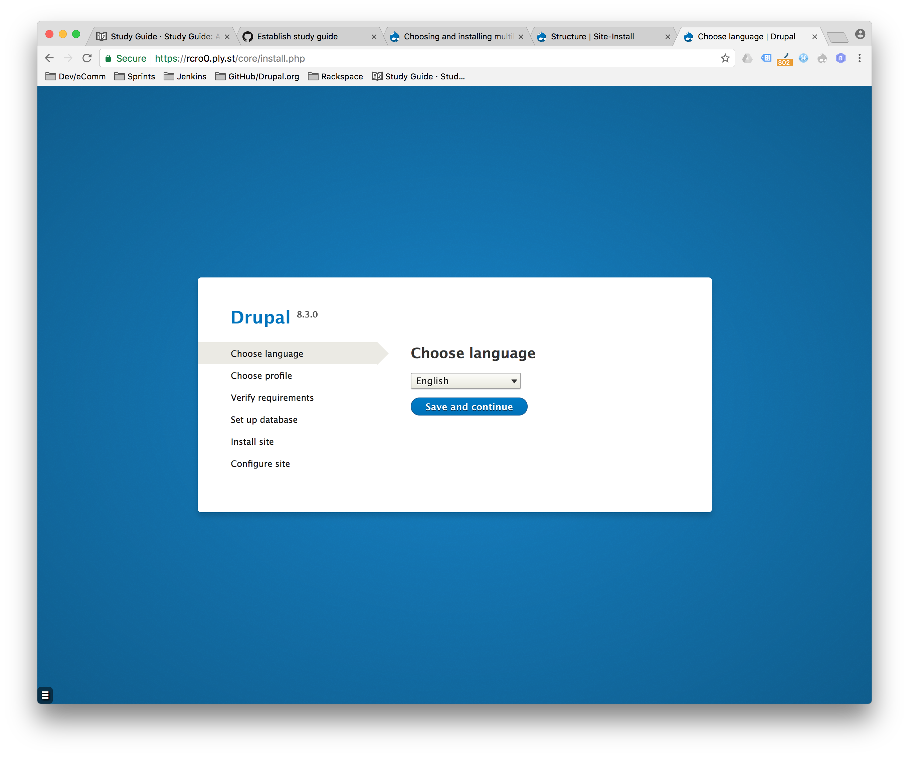

When you select a language other than English, Drupal will automatically enable the necessary multilingual modules (i.e. [Language Module](#language-module) and [Interface Translation Module](#interface-translation-module)), and download the latest translations from [localize.drupal.org](https://localize.drupal.org/).

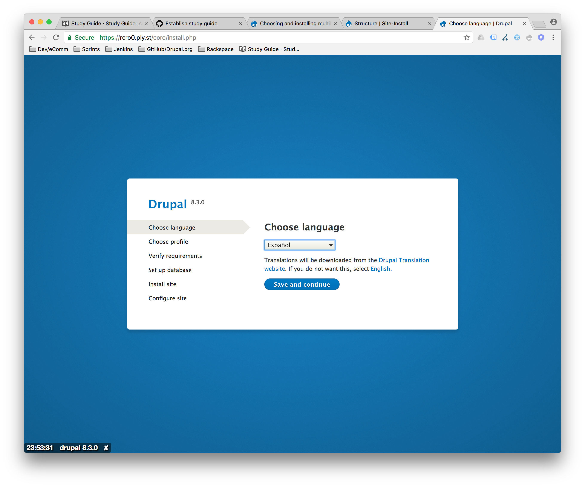

Where Drupal 7 required a very large number of modules to handle distinct aspects of multilingual support, Drupal 8 has most of these features wrapped into just 4 modules to help create a better user experience:

1. [Language Module](#language-module)
2. [Interface Translation Module](#interface-translation-module)
3. [Content Translation Module](#content-translation-module)
4. [Configuration Translation Module](#configuration-translation-module)

## Language Module
_(machine name: `language`)_

From [Choosing and installing multilingual modules](https://www.drupal.org/docs/8/multilingual/choosing-and-installing-multilingual-modules):

> The base module needed for any non-English or multi-lingual site. Allows users to configure languages and how page languages are chosen, and apply languages to content.

This module provides a lot of functionality out of the box:

### Support for many languages (and always improving)
Language support is always improving. You can keep track and contribute to the localization of Drupal at [localize.drupal.org](https://localize.drupal.org/).

To manage language support go to `Configuration` -> `Regional and Language` -> `Languages`

### Everything can have a language
Drupal 8 has made all content easily translatable. This includes nodes, users, views, blocks, menus and many other entity-based components.

*To specify language options for specific content types:*
`Structure` -> `Content Types` -> `(SOME CONTENT TYPE)` -> `Edit` -> `Language Settings`
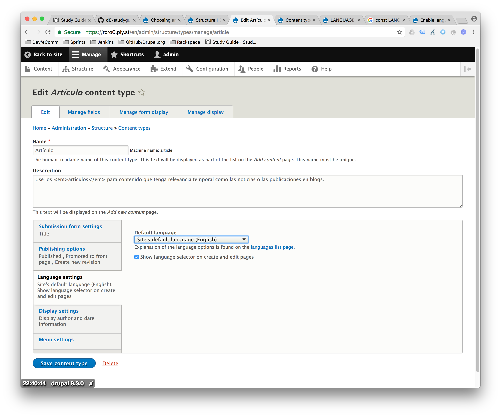

*To specify language options for specific blocks:*
`Structure` -> `Block Layout` -> `(SOME BLOCK)` -> `Configure` -> `Language`
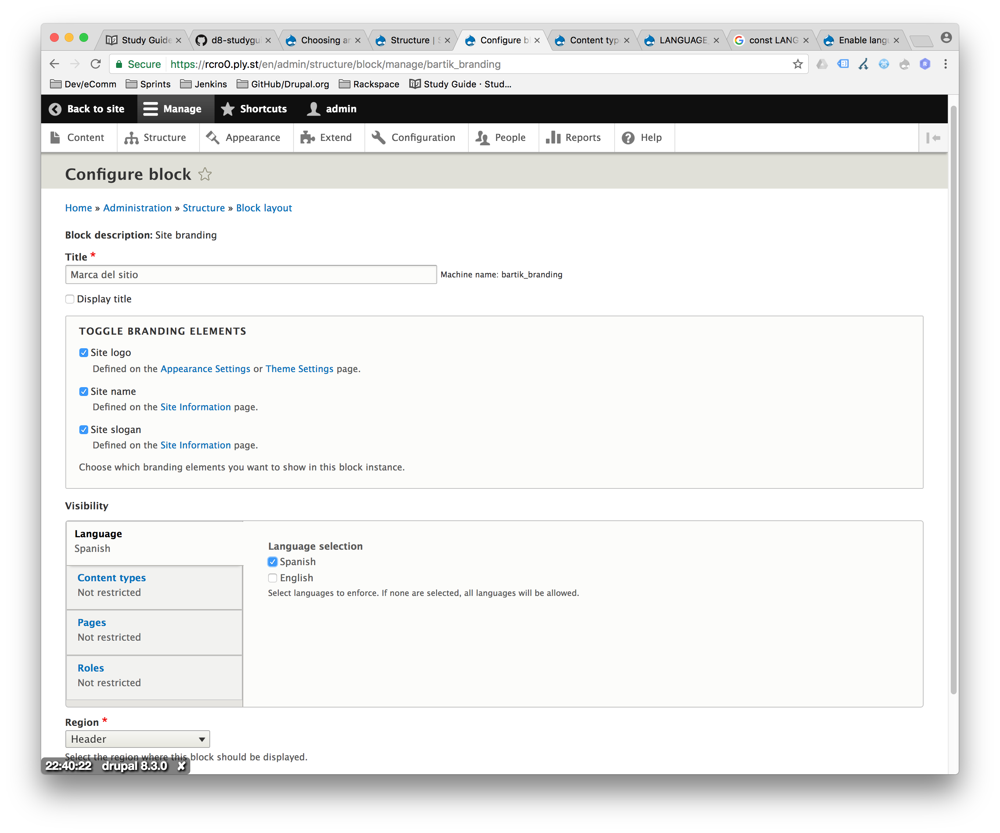

*To specify language options for specific menus:*
`Structure` -> `Menus` -> `(SOME MENU)` -> `Edit Menu` -> `Menu Language`
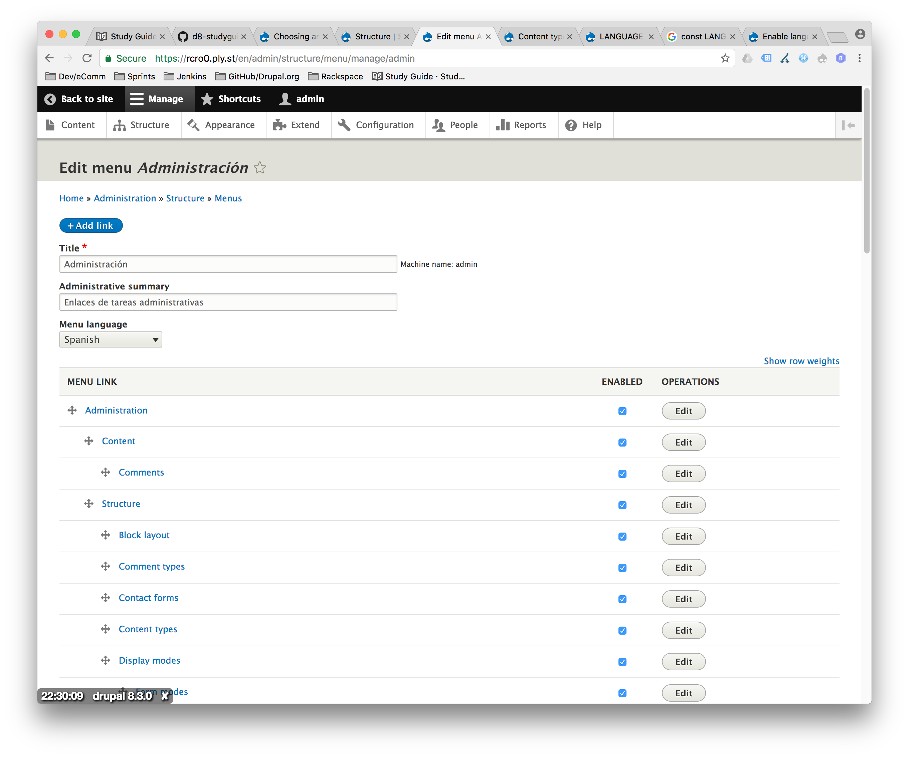

*To specify language options for specific users:*
`People` -> `(SOME USER)` -> `Edit` -> `Language Settings`
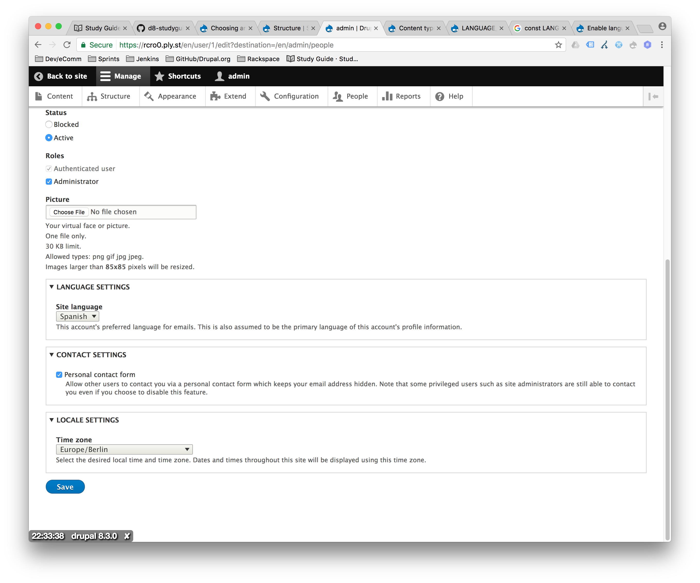

### Two special languages
- Language Not Specified (`const LANGUAGE_NOT_SPECIFIED = 'und'`) - Used when multilingual options are available, but unused for a particular piece of content. This is comparable to `LANGUAGE_NONE` in Drupal 7.
- Language Not Applicable (`const LANGUAGE_NOT_APPLICABLE = 'zxx'`) - Used when language options do not apply to a particular piece of content (e.g. an image)

### Language negotiation

There are multiple methods to detect which language should be used. You can opt to use as many methods as you want to evaluate a user's language preference.

The options are available, from [Enable Language Negotiation](https://www.drupal.org/docs/7/multilingual/translating-site-interfaces/enable-language-negotiation):
> - URL - Determine the language from the URL (Path prefix or Domain).
> - Session - Determine the language from a request/session parameter.
> - User - Follow the user's language preference.
> - Browser - Determine the language from the browser's language settings.
> - Default language - Use the default site language (English).

If multiple methods are selected, Drupal will attempt  methods based on their sort order and fallback to the next method if it cannot determine the language based on a particular method.

To change  methods and the fallback order go to
`Configuration` -> `Regional and Language` -> `Languages` -> `Language Detection and Selection`

### Configurable Browser Language Detection

Browsers use different language codes to refer to the same languages. For example `zh-tw`, `zh-hk` and `zh-mo` may all refer to `Chinese Traditional`.

Drupal will prepopulate this list based on common browser settings, but this list can be customized at
`Configuration` -> `Regional and Language` -> `Languages` -> `Language Detection and Selection` -> `Browser` -> `Configure`
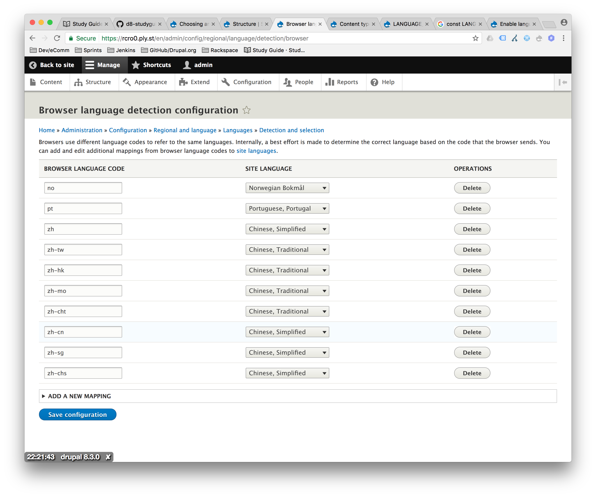

### Transliteration

From [Transliteration class added](https://www.drupal.org/node/1842748):
> The core/component transliteration classes do basic character-by-character transliteration using a database of generic character transliterations and language-specific overrides, which is OK for basic uses such as creating legal file names and machine names, but not good for transliterating prose (which would require consideration of context, capitalization, etc.).

## Interface Translation Module
*(machine name: `locale`)*

From [Choosing and installing multilingual modules](https://www.drupal.org/docs/8/multilingual/choosing-and-installing-multilingual-modules):

> When enabled, the core Interface Translation ("Locale" in versions before Drupal 8) module allows you to present your Drupal site in a language other than the default (English).
>
> You can use it to set up a multilingual web site or to replace the elements of the interface text with text which has been customized for your site. Whenever the Interface Translation module encounters text, it tries to translate it into the currently selected language. If a translation is not available, the string is remembered, so you can look up untranslated strings easily.

To translate specific UI strings go to:
`Configuration` -> `Regional and Language` -> `Languages` -> `User Interface Translation` and then selecting your language and specifying translation values for each particular string.

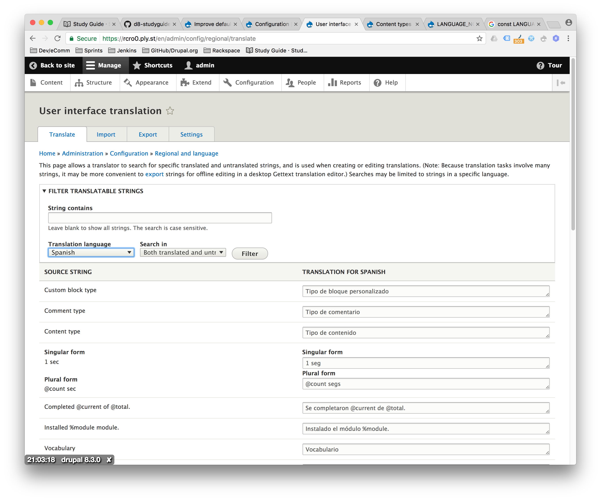

To configure your UI translation settings go to:
`Configuration` -> `Regional and Language` -> `Languages` -> `User Interface Translation` -> `Settings`

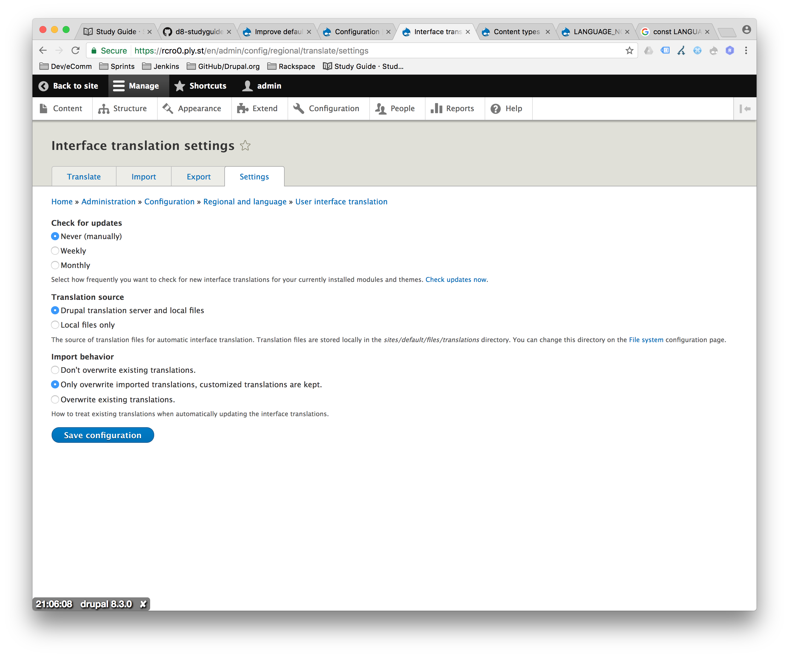

From here you can either configure automatic update language synchronization from localize.drupal.org, or click the `Check Updates Now` link, to pull down the latest translation strings for your UI.

## Content Translation Module
*(machine name: `content_translation`)*

From [Choosing and installing multilingual modules](https://www.drupal.org/docs/8/multilingual/choosing-and-installing-multilingual-modules):

> Allows users to translate content entities. Allows you to translate your site content, including pages, taxonomy terms, blocks, etc., into different languages.

### Default translation settings
`Configuration` -> `Regional and Language` -> `Content language and translation`.
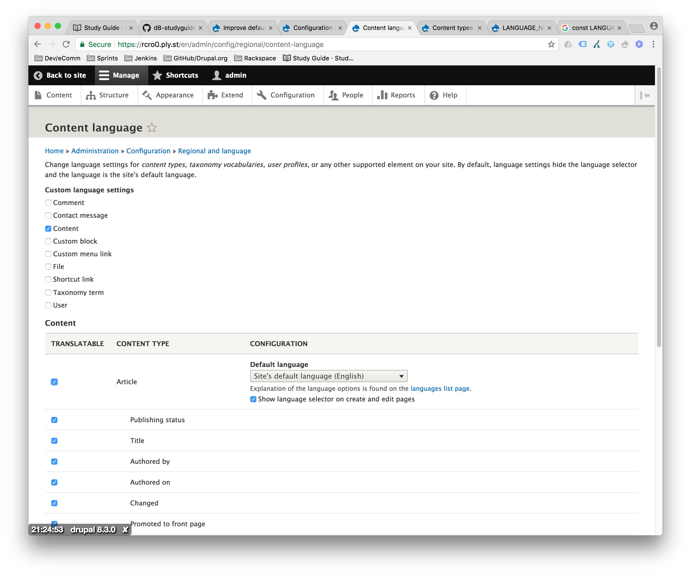

Check the "Translatable" checkbox next to each item you want to translate.

### Translating a node

While viewing a node of a content type with translation enabled, you should now see a `Translate` tab.
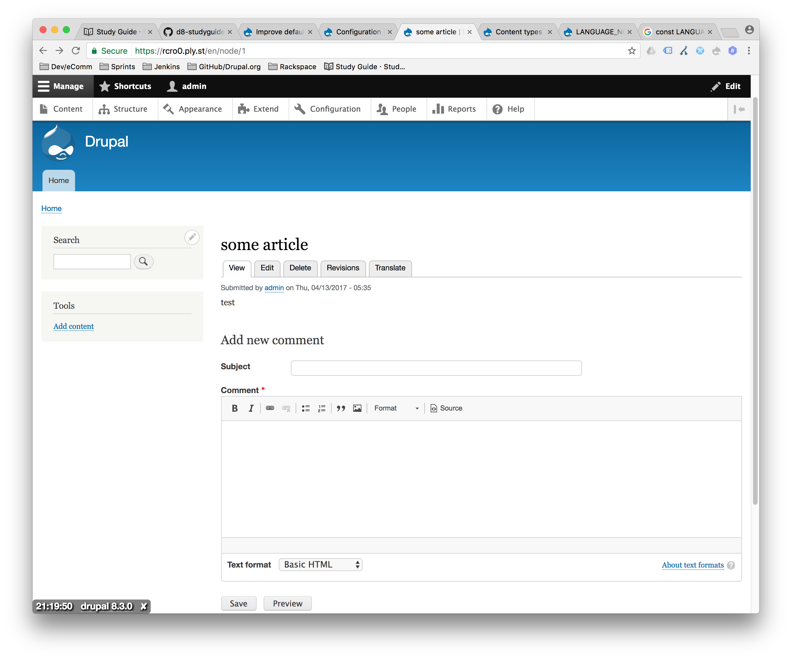

Click `Add` next to the language you wish to translate.
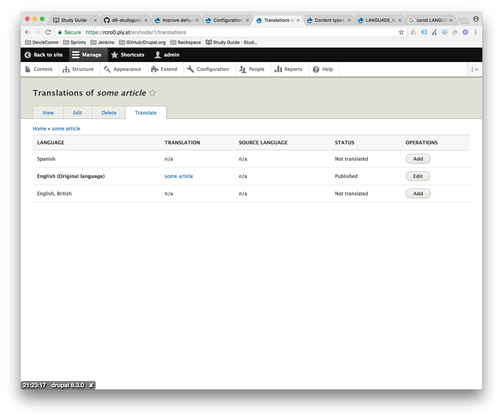

Specify the translated node content and then save.
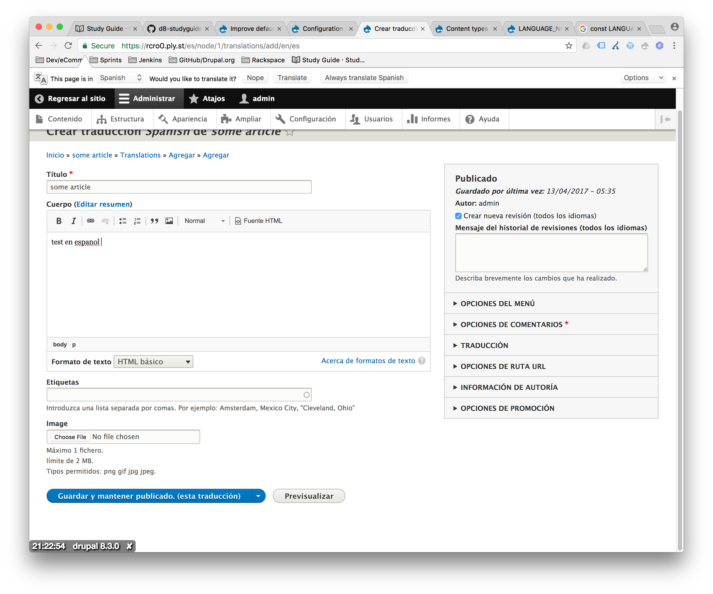

## Configuration Translation Module
*(machine name: `config_translation`)*

From [Choosing and installing multilingual modules](https://www.drupal.org/docs/8/multilingual/choosing-and-installing-multilingual-modules):

> Provides a translation interface for configuration. Allows you to translate text that is part of the configuration, such as field labels, the text used in Views, etc.

To translate configuration settings go to
`Configuration` -> `Regional and Language` -> `Configuration translation`.
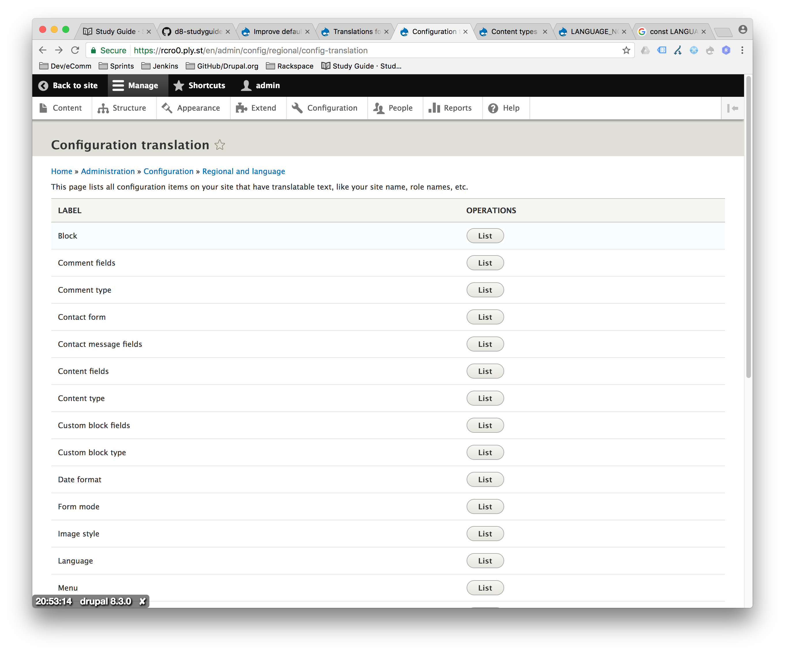

Find a configuration setting you wish to translate and click the `Translate` button. (Note: If you see a button that says `List` instead of `Translate`) this means you're in a parent group and must click through to get to more specific configuration settings.
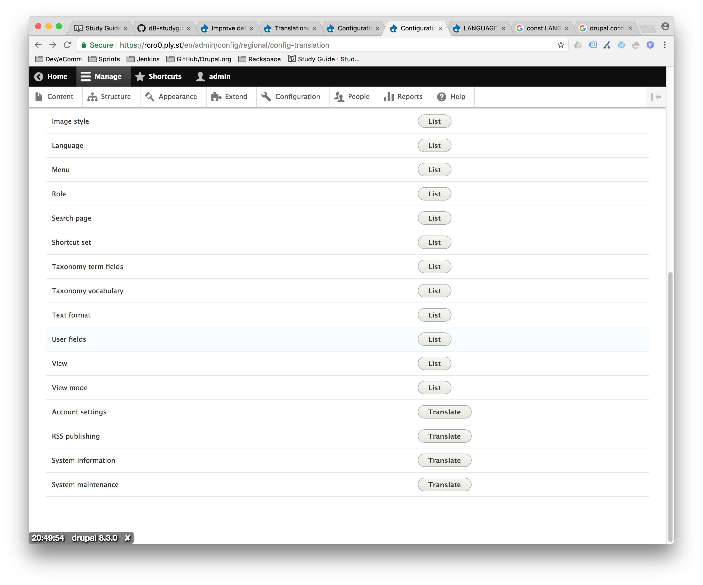

When you click `Translate` on a particular item, you should see the option to either add or edit an existing translation.
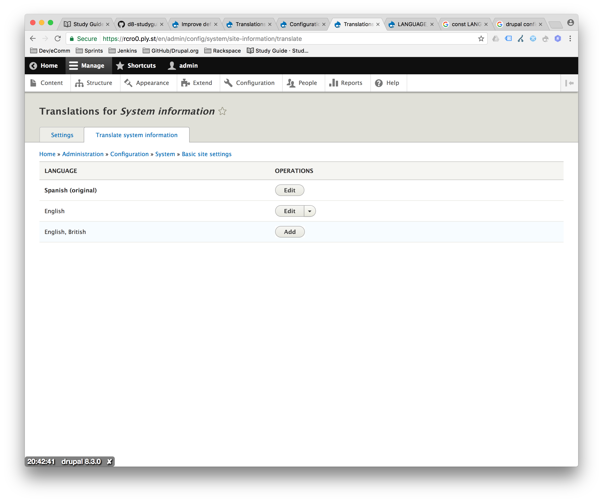

Edit the particular settings you wish to update and then click the `Save Translation` button.
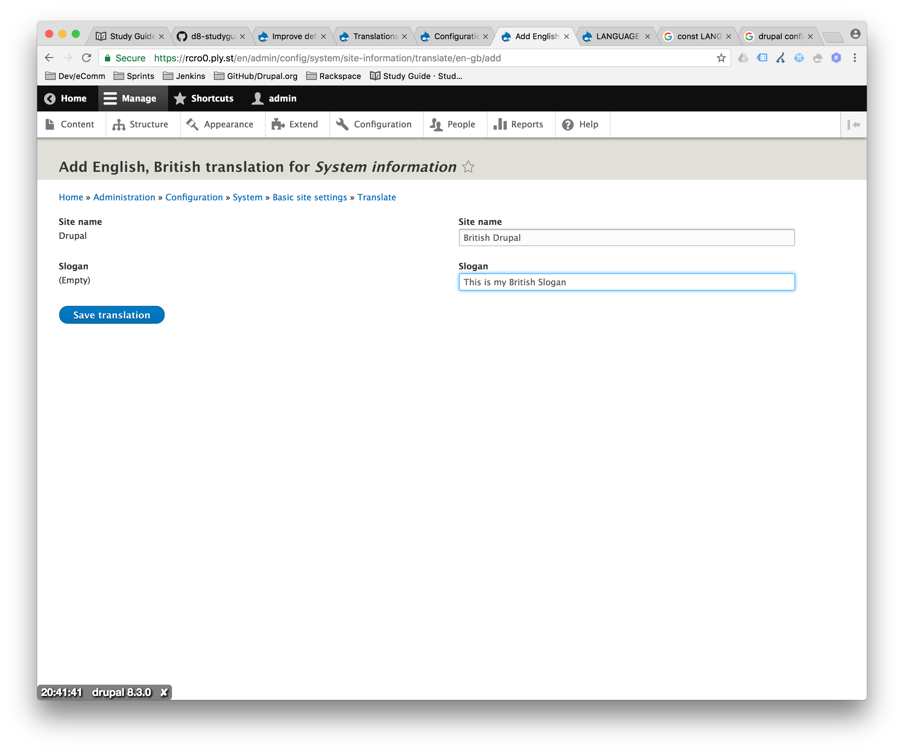

[See Configuration Management](2.7-configuration-management.md) for more information on managing configurations in Drupal.

## Additional Resources

- [drupal.org - Multilingual Guide](https://www.drupal.org/docs/8/multilingual/)
- [dev.acquia.com - Ultimate Guide to Drupal 8: Episode 4 - Multilingual Improvements](https://dev.acquia.com/blog/ultimate-guide-drupal-8-episode-4-multilingual-improvements)
- [drupal8multilingual.org - Drupal 8 Multilingual Initiative](http://www.drupal8multilingual.org/)
- [lingotek.com - Drupal 8 Multilingual APIs](https://www.lingotek.com/ebook-drupal-8-multilingual-apis)
- [drupal.org - Enable Language Negotiation) ](https://www.drupal.org/docs/7/multilingual/translating-site-interfaces/enable-language-negotiation)
